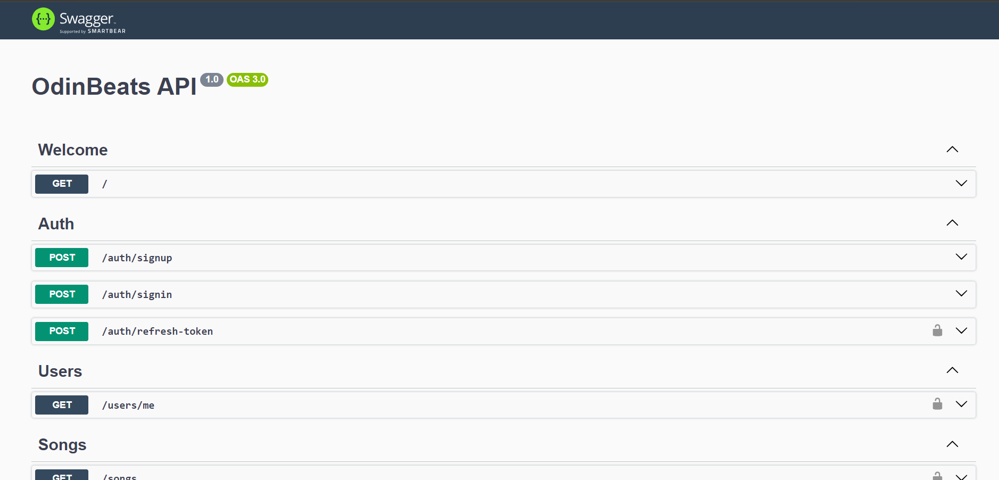

# OdinBeats API

OdinBeats API is the backend service for the OdinBeats web application. It provides endpoints for user authentication, managing playlists, and songs. This API utilizes JWT authentication with refresh tokens for secure access to resources.

## Live Demo

You can explore a live demo of the OdinBeats API by visiting the following URL:

[OdinBeats API Demo](https://odinbeats-api.onrender.com)

The live demo provides access to a deployed instance of the API, allowing you to interact with the endpoints and explore its functionality in real-time.

## Installation

To run the OdinBeats API locally, follow these steps:

1. Clone the repository:

   ```bash
   git clone https://github.com/rafieissam/odinbeats-api.git
   ```

2. Navigate to the project directory:

   ```bash
   cd odinbeats-api
   ```

3. Install dependencies:

   ```bash
   npm install
   ```

4. Set up environment variables by copying the `.env copy` file and filling in the required fields:

   ```bash
   cp .env copy .env
   ```

5. Start the PostgreSQL database using Docker Compose:

   ```bash
   npm run db:dev:up
   npm run db:dev:migrate-deploy
   ```

6. Seed the database with initial data:

   ```bash
   npm run seed
   ```

7. Start the server in development mode:

   ```bash
   npm run start:dev
   ```

## API Documentation

After starting the server, you can access the API documentation by navigating to the following URL:
```
http://localhost:3000/docs
```
The API documentation provides detailed information about the available endpoints, request parameters, response formats, and authentication requirements. Below is a screenshot of the API documentation:


## Used Technologies

The OdinBeats API is built using the following technologies and frameworks:

- [Nest.js](https://nestjs.com/): A progressive Node.js framework for building efficient, reliable, and scalable server-side applications.
- [Prisma](https://www.prisma.io/): A modern database toolkit for TypeScript and Node.js.
- [PostgreSQL](https://www.postgresql.org/): An open-source relational database management system.
- [Docker](https://www.docker.com/): A platform for building, shipping, and running applications in containers.
- [JWT (JSON Web Tokens)](https://jwt.io/): A compact, URL-safe means of representing claims to be transferred between two parties.

These technologies are utilized to ensure the efficiency, security, and scalability of the OdinBeats API.

## Future Work

- **Entities for Albums and Artists**: Convert "albums" and "artists" from strings into actual entities within the database. This will allow for more robust management and organization of albums and artists.

- **Admin User Functionality**: Implement an admin user role with privileges to manage songs, albums, and artists. This includes CRUD operations for these entities.

- **User Interaction Features**: Enable users to follow artists and favorite albums. This will enhance user experience and engagement with the platform.

## License

This project is licensed under the [MIT License](https://opensource.org/licenses/MIT) - see the [LICENSE](LICENSE) file for details.